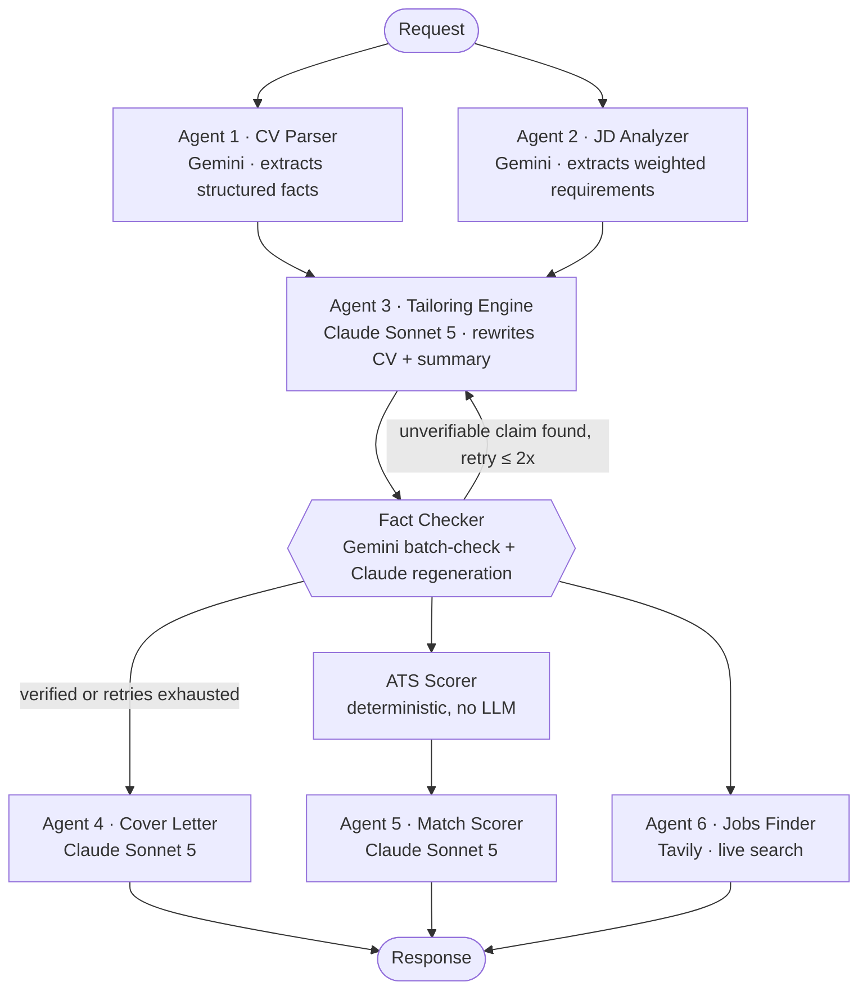
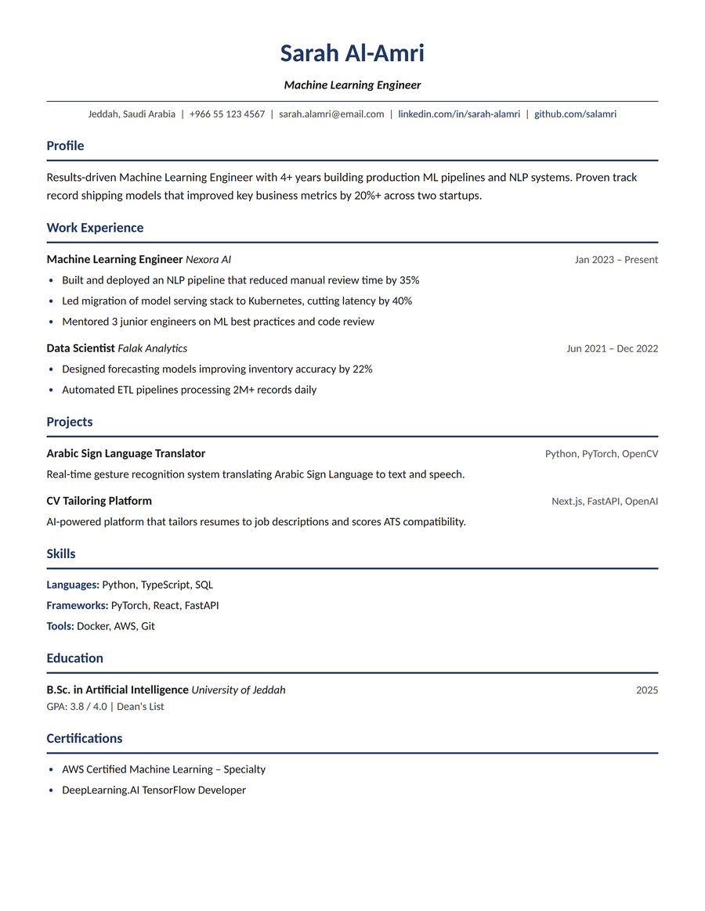
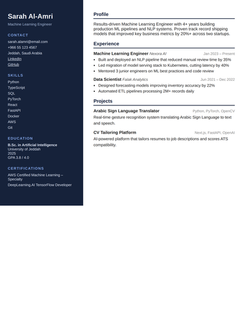
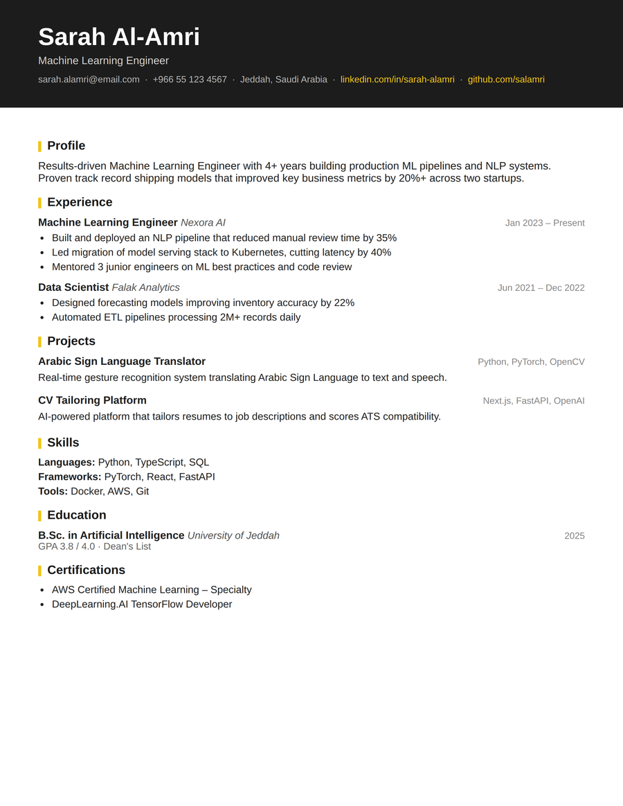

<div align="center">

# Tarshih (ترشيح)

**AI-powered CV tailoring, built as a real multi-agent system. Not a single prompt wearing a trench coat.**

Upload a CV and a job description. Eight specialized agents read both, rewrite your resume and cover letter to genuinely fit the role, fact-check every claim against what you actually wrote, score your ATS compatibility, and go find you similar jobs that are actually open right now, in English or Arabic.

[**Live App →**](https://www.tarshih.com/) &nbsp;·&nbsp; [Report a Bug](https://github.com/Ryzx-56/Job_Application_Agent/issues) &nbsp;·&nbsp; [Author](#author)


</div>

---

## What this actually is

Tarshih is a full-stack, production SaaS product: paying subscribers, real infrastructure, a live multi-agent AI pipeline doing genuine work on every request. Not a demo, not a wrapper around one API call.

It was designed, built, and shipped **solo**, front to back: the LangGraph agent orchestration, the FastAPI backend, the Next.js frontend, the Supabase auth/billing/data layer, and the prompt engineering holding the whole pipeline together against hallucination.

Every generation runs **8 coordinated agents across 3 different AI providers** (Anthropic Claude, Google Gemini, and Tavily's search API) in a graph that fans work out in parallel where it can and loops back on itself when a rewritten bullet point can't be verified against the facts. A single CV generation can trigger anywhere from 6 to 20+ real API calls, depending on how much the fact-checker has to push back.

## Table of Contents

- [Key Features](#key-features)
- [The Agent Pipeline](#the-agent-pipeline)
- [What the Output Looks Like](#what-the-output-looks-like)
- [Tech Stack](#tech-stack)
- [Engineering Notes](#engineering-notes)
- [Getting Started](#getting-started)
- [Project Structure](#project-structure)
- [License](#license)
- [Author](#author)

## Key Features

- **Real tailoring, not rephrasing**

  The tailoring engine rewrites your summary, experience bullets, and project descriptions against the specific job description, while a separate fact-checking agent independently verifies every claim traces back to something you actually wrote. Nothing gets invented. If a rewrite can't be verified, it's regenerated and re-checked, up to twice, before falling back to the original.

- **ATS compatibility scoring**

  Computed deterministically: keyword, skills, education, and experience match against the job description. No LLM in the loop for this one, so it's instant and can't drift.

- **Semantic job-fit scoring**

  A second, independent read on how well you actually match the role, with a plain-language explanation and a structured skill-gap analysis: what's missing, how important it is, how to close it.

- **Live similar-job search**

  Prioritizes Saudi Arabia's national employment platform (Jadarat) and blends in a curated list of established global and Gulf/MENA job boards (LinkedIn, Indeed, Bayt, GulfTalent, and more) when it doesn't have enough good matches on its own. Filters out closed listings, scam signals, and board/category pages that aren't real postings.

- **11 CV templates**

  Each rendered properly in both PDF (WeasyPrint, real CSS layout engine) and Word/DOCX (python-docx, styled to match).

- **Fully bilingual**

  English and Arabic, including right-to-left layout, Arabic text shaping, and digit/date-term localization, not just a translated UI shell around English-only output.

- **Live progress streaming**

  The dashboard shows each agent completing in real time over Server-Sent Events, instead of a blank spinner for 20 seconds.

- **Accounts, subscriptions, and credits**

  Handled via Supabase, with a resume history that's retained by tier (soft-archived past the cap, never silently deleted) and paginated so it stays fast as it grows.

## The Agent Pipeline



| # | Agent | Model / Tool | Job |
|---|---|---|---|
| 1 | CV Parser | Gemini 3.1 Flash Lite | Extracts structured facts (experience, education, skills, projects) from an uploaded PDF or the manual entry form. Extraction only, never invents or improves anything |
| 2 | JD Analyzer | Gemini 3.1 Flash Lite | Pulls required vs. preferred skills, seniority, ATS keywords, and culture signals out of the job description (runs in parallel with Agent 1) |
| 3 | Tailoring Engine | Claude Sonnet 5 | Rewrites the summary, bullets, and project descriptions to align with the target role, grounded strictly in Agent 1's extracted facts |
| - | Fact Checker | Gemini (batch) + Claude (regeneration) | Verifies every tailored bullet's claims trace back to verified facts. Not a style check, a truth check. Loops back to Agent 3 for anything that fails, up to 2 rounds |
| 4 | Document Generator | Claude Sonnet 5 | Writes the matching cover letter |
| 5 | Match Scorer | Claude Sonnet 5 | Semantic job-fit score, gap analysis, and a plain-language recommendation |
| - | ATS Scorer | Deterministic (no LLM) | Keyword/skills/education/experience match against the JD (instant, reproducible) |
| 6 | Jobs Finder | Tavily | Finds real, currently-open, relevant listings (Jadarat-prioritized, noise- and scam-filtered) |

Once fact-checking clears, the cover letter, ATS score, and job search all run **in parallel**. There's no reason to make a user wait for three independent branches to run one after another.

## What the Output Looks Like

Three of the eleven CV templates the pipeline can render (PDF and DOCX, both from the same tailored content):

<table>
<tr>
<td></td>
<td></td>
<td></td>
</tr>
<tr>
<td align="center"><sub>Navy Executive</sub></td>
<td align="center"><sub>Sidebar Dark</sub></td>
<td align="center"><sub>Bold Banner</sub></td>
</tr>
</table>

## Tech Stack

| Layer | Technology |
|---|---|
| **Frontend** | Next.js 16 (App Router, Turbopack), TypeScript, Tailwind CSS |
| **Backend** | FastAPI (Python 3.11), served over Server-Sent Events for live progress |
| **Agent orchestration** | LangGraph: a real stateful graph with conditional routing and retry loops, not a linear chain |
| **LLMs** | Claude Sonnet 5 (Anthropic) for generation-quality tasks, Gemini 3.1 Flash Lite (Google) for high-volume extraction/verification tasks |
| **Job search** | Tavily API |
| **Auth, database, storage** | Supabase (Postgres + Row Level Security + Auth) |
| **PDF rendering** | WeasyPrint: real HTML/CSS layout via Pango/Cairo, not a headless-browser screenshot |
| **DOCX rendering** | python-docx, with per-template style presets |
| **Payments** | Third-party payment gateway (provider selection and integration in progress) |
| **Hosting** | Vercel (frontend) · Render (backend) |

## Engineering Notes

A few things under the hood that aren't obvious from the feature list:

- **Concurrency-safe by construction**

  Every generated file is keyed by `{verified user ID}_{request ID}` on both write and read. Two people generating at the same time, or a guessed/replayed request ID, can never resolve to someone else's file.

- **Prompt-caching aware**

  The tailoring engine's system prompt is large and static per request. It's marked for Anthropic's ephemeral prompt caching so repeated structure doesn't get re-billed and re-processed every call.

- **Parallel where it's actually independent**

  Document rendering (CV PDF, CV DOCX, cover letter PDF) and the fact-checker's per-bullet regeneration calls run concurrently via a thread pool instead of one-at-a-time. Real, measurable latency work, not just async syntax for its own sake.

- **Binary-searched page fitting**

  Fitting a CV onto one well-filled page (without visibly shrinking it) is framed as a search over a scale variable, converged on with binary search against WeasyPrint's own page-count output, not a fixed-size template that just clips overflow.

- **Storage that doesn't grow forever**

  Rendered PDFs/DOCX aren't stored. The small structured data behind them is, and the file is regenerated on demand when someone actually opens it. A database trigger enforces per-tier history retention (archived, never destroyed) without any application code needing to know about it.

- **Full bilingual pipeline, not a translated skin**

  Arabic output gets real Pango-driven RTL shaping and bidi handling in the PDF path, and its own font/shaping treatment in the DOCX and cover-letter paths, plus content-level digit and date-term localization.

## Getting Started

### Prerequisites

- Python 3.11
- Node.js 18+
- A [Supabase](https://supabase.com) project
- API keys: [Anthropic](https://console.anthropic.com), [Google AI Studio](https://aistudio.google.com) (Gemini), [Tavily](https://tavily.com)
- **Windows only:** WeasyPrint needs GTK's native libraries (Pango/Cairo), which don't come from pip. Install [MSYS2](https://www.msys2.org/), then run `pacman -S mingw-w64-x86_64-pango` and add `C:\msys64\mingw64\bin` to your PATH. macOS and Linux don't need this step.

### Backend

```bash
cd backend
python -m venv venv
source venv/bin/activate        # venv\Scripts\activate on Windows
pip install -r requirements.txt
cp ../.env.example ../.env      # fill in your API keys and Supabase credentials
uvicorn main:app --reload
```

### Frontend

```bash
cd frontend
npm install
cp env.local.example .env.local  # fill in your Supabase URL + anon key
npm run dev
```

The frontend expects the backend at `NEXT_PUBLIC_API_URL` (defaults to `http://127.0.0.1:8000` locally).

## Project Structure

```
backend/
├── agents/         # The 6 numbered agents (cv_parser, jd_analyzer, tailoring_engine, ...)
├── core/           # Orchestration graph, auth, credits/subscriptions, fact-checking loop
├── schemas/        # Pydantic contracts between agents
├── templates/      # 11 Jinja2 CV/cover-letter HTML templates
├── utils/          # PDF/DOCX rendering, ATS scoring, page-fit logic
└── main.py         # FastAPI app + SSE streaming endpoints

frontend/
└── src/
    ├── app/        # Next.js App Router pages (dashboard, resumes, settings, admin)
    ├── components/ # Shared UI
    └── lib/        # Supabase clients, i18n copy, API helpers
```

## License

This project is proprietary, see [LICENSE](LICENSE). You're welcome to view and fork the repo for personal, non-commercial reference, but reuse, redistribution, or commercial use requires written permission.

## Author

**Abdulmalik Hawsawi**, AI undergraduate at the University of Jeddah, building production AI/ML systems solo, end to end.

Tarshih was designed, built, and is maintained entirely by one person: the agent pipeline, the backend, the frontend, the data model, and the infrastructure holding it all together in production.

[LinkedIn](https://www.linkedin.com/in/abdulmalik-hawsawi/) &nbsp;·&nbsp; [GitHub](https://github.com/Ryzx-56) &nbsp;·&nbsp; [abdulmalikhawsawi0@gmail.com](mailto:abdulmalikhawsawi0@gmail.com)
